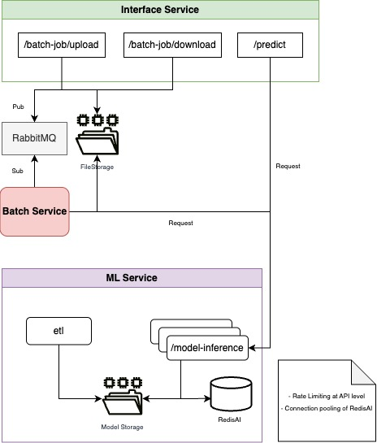

# AIMQ Demo - RedisAI | RabbitMQ

## Overview

A Microservice Pipeline for File Processing & ML Inference with **RabbitMQ** + **RedisAI**.

**AIMQ** demonstrates a scalable microservice architecture that processes files through an ML pipeline using:

- **RabbitMQ** for message queueing
- **RedisAI** for model caching and inference

## Architecture & Key Features



### 1. **Interface Service (Go + RabbitMQ)**

- Handles file uploads / downloads
- Publishes messages to RabbitMQ
- Stores files in persistent storage

### 2. **Batch Processor (Python + RabbitMQ)**

- Subscribes to RabbitMQ queues
- Processes files and prepares ML inference requests
- Manages the workflow between Queue and AI service

### 3. **ML Service (Python + RedisAI)**

- Provides ETL, model training, and inference endpoints
- Caches models in RedisAI for low-latency predictions

## Tech Stack

- **Messaging**: RabbitMQ
- **AI Caching**: RedisAI
- **Languages**: Go (API), Python (ML/Batch)
- **Storage**: (Local)
- **Containerization**: Docker
- **Orchestration**: Docker Compose, Kubernetes

## Getting Started

### Prerequisites

- Docker
- Docker Compose
- Python 3.12

## Detailed Documentation

### 1. **Interface Service**

TODO

### 2. **Batch Processor**

TODO

### 3. **ML Service**

TODO

## Quick Start with Docker Compose (Locally)

1. **Clone the repository:**

```git
git clone https://github.com/StephenDsouza90/RedisAI-RabbitMQ-Demo.git
cd RedisAI-RabbitMQ-Demo
```

2. **Run ETL Pipeline to create models:**

```python
# Install packages and dependencies
pip install -r requirements.txt

# Run script
python ml/etl/main.py
```

3. **Start all services:**

```docker
# Start Services
docker-compose up --build -d

# Check services (6 must be running)
docker ps
```

Output
```
CONTAINER ID   IMAGE                             COMMAND                  CREATED              STATUS                   PORTS                                                                                                         NAMES
0b590a74d39f   redisai-rabbitmq-demo-interface   "./interface"            About a minute ago   Up About a minute        0.0.0.0:8080->8080/tcp                                                                                        redisai-rabbitmq-demo-interface-1
42d1bfe0732a   redisai-rabbitmq-demo-ml          "uvicorn --reload --…"   About a minute ago   Up About a minute        0.0.0.0:5001->5001/tcp                                                                                        redisai-rabbitmq-demo-ml-1
6d4ec0055b96   redisai-rabbitmq-demo-batch       "python -u batch/mai…"   About a minute ago   Up About a minute        0.0.0.0:5000->5000/tcp                                                                                        redisai-rabbitmq-demo-batch-1
eb375fe54484   redis:6                           "docker-entrypoint.s…"   9 minutes ago        Up 9 minutes (healthy)   0.0.0.0:6379->6379/tcp                                                                                        redisai-rabbitmq-demo-redis-1
901b902f0765   rabbitmq:3-management             "docker-entrypoint.s…"   9 minutes ago        Up 9 minutes (healthy)   4369/tcp, 5671/tcp, 0.0.0.0:5672->5672/tcp, 15671/tcp, 15691-15692/tcp, 25672/tcp, 0.0.0.0:15672->15672/tcp   redisai-rabbitmq-demo-rabbitmq-1
b1a6a1459143   redislabs/redisai:latest          "docker-entrypoint.s…"   9 minutes ago        Up 9 minutes (healthy)   0.0.0.0:6380->6379/tcp                                                                                        redisai-rabbitmq-demo-redisai-1
```

4. **Use Interface Service:**

Upload files (Test files are available)

```
curl -X POST http://localhost:8080/upload -F "file=@assets/sample_files/1_row.xlsx"
```

Output
```
{"message":"File uploaded and message sent"}
```

Prediction Requests
```
curl -X POST http://localhost:8080/predict \
-H "Content-Type: application/json" \
-d '{
  "model_group": "A",
  "model": 180,
  "kilometers": 5000,
  "fuel_type": "Diesel",
  "gear_type": "Manual",
  "vehicle_type": "Sedan Car",
  "age_in_months": 12,
  "color": "Black",
  "line": "Sportline",
  "doors": "4 to 5",
  "seats": "1 to 3",
  "climate": "Air Conditioning"
}'
```

Output
```
{"predicted_price":32424.388671875}
```

5. **Check RabbitMQ (If needed):**

```
http://localhost:15672
```

6. **Use ML Inference directly:**

```
# Use swagger UI
http://localhost:5001/docs

# Request Body
{
  "modelGroup": "A",
  "model": "180",
  "kilometers": 10789,
  "fueltype": "Diesel",
  "geartype": "Automatic",
  "vehicletype": "Sedan Car",
  "ageinmonths": 20,
  "color": "Black",
  "line": "Sportline",
  "doors": "4 to 5",
  "seats": "1 to 3",
  "climate": "Air Conditioning"
}
```

7. **Stop services:**

```
# ...
docker-compose down

# ...
docker-compose down -v
```

## Quick Start with Kubernetes (Locally)

## Testing
